[](https://classroom.github.com/a/KujF6lFv)

# Trabajo Práctico - Técnicas de Programación Concurrente

***Importante**: Estas primeras secciones muestran el avance del trabajo práctico hasta la primera entrega, realizada el 27 de mayo de 2026. Para ver los avances estipulados para la entrega final, **dirigirse al [anexo de la última entrega](#anexo-cambios-realizados-para-la-entrega-final)** que se encuentra al final de este mismo README (aquí se ven de forma actualizada todos los aspectos del proyecto).*

## Integrantes

Los integrantes del grupo para desarrollar el presente trabajo son:

- Ariana Magalí Salese D'Assaro, 105558
- Lucas Ariel Conde Cardó, 112201
- Pedro Tomás Ciliberto, 111918

## Finalidad general del sistema

Se desarrollará un sistema para gestionar el alquiler y devolución de bicicletas en una ciudad. Este estará compuesto por 5 entidades: Aplicación Usuario, Estación, Bicicleta, Sistema Central y Procesador de Pagos. Cada una de estas se encuentra descrita en la siguiente sección y tendrá un rol fundamental en el funcionamiento de este servicio. No obstante, se aplicarán soluciones a problemas comunes, como pérdidas de conexión y detenciones de funcionamiento, para lograr que el sistema sea resiliente y ofrezca una alta disponibilidad para sus usuarios incluso, ante la caída de alguna entidad fundamental.

Las mencionadas entidades, a excepción de Sistema Central y Procesador de Pagos, podrán tener múltiples instancias corriendo concurrentemente y, como se verá en la sección de “Casos de Interés”, será el pilar fundamental para una gran parte de las decisiones de diseño tomadas.

## Entidades

A continuación se describen las entidades mencionadas:

### Aplicación Usuario

Modela el funcionamiento de la aplicación que utiliza cada usuario en su dispositivo móvil y permite su comunicación tanto con el Sistema Central como con las estaciones. Esta entidad es capaz de visualizar qué estaciones tiene cerca, junto con su estado, y comunicarse de forma directa con estas para solicitar el alquiler o realizar la devolución de una bicicleta.

```rust
struct UsuarioApp {
    id: usize,
    sistema_central: SocketAddr,
    tarjeta_de_credito: TarjetaDeCredito,
    estaciones: HashMap<usize, (Coordenadas, SocketAddr)>, // ID, coordenadas y dirección de la estación.
    bicicletas_en_uso: HashMap<usize, SocketAddr>, // ID de la bicicleta y dirección del proceso que la representa.
}
```

#### Estado interno:

* **id**: identificador único del usuario.

* **sistema_central**: La dirección (IP y puerto) que utilizará para comunicarse, mediante UDP, con el Sistema Central.

* **tarjeta_de_credito**: Datos de la tarjeta de crédito (número, código de seguridad y vencimiento).

* **estaciones**: Diccionario que contiene todas las estaciones. Tiene como clave el ID de cada estación, y como valor una tupla con las coordenadas de la estación y su dirección para comunicarse directamente con ella. 

* **bicicletas_en_uso**: Diccionario con el ID y la dirección de cada bicicleta que el usuario se encuentra utilizando (un mismo usuario puede retirar varias bicicletas al mismo tiempo, por ejemplo, para un grupo de amigos que viajan juntos).

#### Mensajes que envía:

* **SolicitarEstado()**: Se utiliza para consultarle a una estación qué slots tiene libre y ocupados.
  
    ```rust
    // UDP
    pub struct SolicitarEstado;
    ```

* **PedirBicicleta(id_usuario, numero_slot, tarjeta_de_credito)**: Se utiliza para solicitarle a una estación una bicicleta en un slot y, por ende, se incluye el número de slot (para indicar qué bicicleta se quiere solicitar) y los datos de la tarjeta de crédito del usuario, para pre-autorizar el viaje. Además, se incluye el id del usuario para que la estación pueda notificarle a la bicicleta que se comienza a utilizarla por parte de ese usuario en particular.
    
    ```rust
    // TCP
    pub struct PedirBicicleta {
        id_usuario: usize,
        numero_slot: u8, // Número de slot, entre 0 y 19.
        tarjeta_de_credito: TarjetaDeCredito, // Número, cód. de seguridad y vencimiento.
    }
    ```
      
* **DevolverBicicleta(id_usuario, numero_slot, bicicleta_en_uso, tarjeta_de_credito)**: Se utiliza para solicitarle, a una estación, la devolución de una bicicleta en un slot. Para esto, se debe indicar el número de slot en el que se quiere dejar la bicicleta, la bicicleta en si y los datos de la tarjeta de crédito del usuario, para cobrar el viaje. Además, se incluye el id del usuario para que cuando la bicicleta le brinde el inicio de uso a la estación, esta sepa a qué usuario cobrarle el viaje.

    ```rust
    // TCP
    pub struct DevolverBicicleta {
        id_usuario: usize,
        numero_slot: u8, // Número de slot, entre 0 y 19.
        bicicleta: BicicletaEnUso, // ID y dirección.
        tarjeta_de_credito: TarjetaDeCredito,
    }
    ```
  
* **VisualizarEstadoEstaciones(estaciones)**: En este mensaje, el usuario puede solicitarle al Sistema Central que le informe sobre el estado de las estaciones, que previamente calculó cercanas a su ubicación.

    ```rust
    // UDP
    pub struct VisualizarEstadoEstaciones {
        estaciones: Vec<usize>, // IDs de las estaciones (capaz que se podrían identificar por coordenadas sino).
    }
    ```

#### Mensajes que recibe (ver la definición de su estructura y su repercusión en el emisor, en el apartado correspondiente a la entidad dada):

* **EnviarEstado(slot_libres, slots_ocupados)**: Al recibir este mensaje, el usuario conoce qué slots se encuentran vacíos u ocupados en la estación que lo envía.

* **EntregarBicicleta(bicicleta)**: Al recibir este mensaje por parte de la estación, el usuario conoce que la bicicleta que solicitó le fue asignada correctamente.

* **NoTengoBiciletaEnEsteSlot(numero_slot)**: Al recibir este mensaje por parte de la estación, el usuario sabe que la bicicleta que solicitó, en un determinado slot, no está disponible. En un “caso borde”, esto podría deberse a que dos usuarios intentaron solicitar la misma bicicleta al mismo tiempo y solo uno de ellos pudo acceder a la misma.

* **BicicletaDevueltaCorrectamente()**: Con este, el usuario conoce que la bicicleta que intentó devolver fue devuelta con éxito.

* **NoSePudoDevolverBicicletaEnSlot(numero_slot)**: Con este, el usuario conoce que la bicicleta que intentó devolver no pudo ser devuelta con éxito.

* **EstacionesPedidas(estaciones)**: Con este, el Sistema Central le informa al usuario sobre el estado completo de todas las estaciones solicitadas.

### Estación

Representa una estación física la cual alberga los slots, que contienen las bicicletas que los usuarios podrán retirar o donde los usuarios podrán entregar las bicicletas ya retiradas previamente. Se encarga de notificar al sistema central cuando se reciba una bicicleta, es decir, cuando un usuario finalice un viaje, para que este proceda a realizar el cobro del mismo y la devolución del monto de seguridad. En el caso de que al momento de recibir o entregar una bicicleta se encuentre desconectada del Sistema Central, acumulará los pagos a procesar hasta que se los pueda comunicar.

```rust
struct Estacion {
    nombre: String,
    id: usize,
    slots: Vec<EstadoSlot>,
    pagos_a_procesar: VecDeque<Pago>,
    pagos_en_armado: Vec<(usize, Instant, TarjetaDeCredito)>, // ID del usuario, tiempo de fin y tarjeta de crédito del usuario.
    coordenadas: Coordenadas,
}
```

#### Estado interno:

* **nombre:** Nombre de la estación.

* **id**: ID de la estación.

* **slots**: Vector del cual cada uno de sus espacios representa un slot que puede contener una bicicleta (su id y dirección) o encontrarse vacío.

* **pagos_a_procesar**: Cola que almacena los pagos a procesar, es decir, que deben ser comunicados al sistema central. Los pagos pendientes almacenados se componen de la tarjeta de crédito a la que se le debe realizar el cobro y el tipo de pago (pago por viaje finalizado o pago del monto de seguridad).

* **pagos_en_armado**: Vector que almacena los pagos que se encuentran en proceso de armado, es decir, que aún no se encuentran listos para ser comunicados al sistema central y por ende aun no pertecen a la cola de pagos a procesar. Almacenará el ID del usuario que realizó la devolución de una bicicleta, el tiempo de fin del viaje y la tarjeta de crédito del usuario. Luego de que la bicicleta le notifique el tiempo de uso a traves del mensaje BrindarInicioDeUso, se podrá calcular la duración del viaje y se creará el pago para encolarlo en pagos_a_procesar.

* **sistema_central**: Dirección del sistema central.

* **coordenadas**: Almacena la coordenada en el eje $x$ y en el eje $y$ de la estación.

#### Mensajes que envía:

* **EntregarBicicleta(bicicleta)**: Luego de que el usuario solicite la bicicleta de un slot en particular, y este contenga una bicicleta, la estación le notificará que la bicicleta se le entrega.

    ```rust
    // TCP
    pub struct EntregarBicicleta {
        bicicleta: BicicletaEnUso,
    }
    ```
  
* **NoTengoBicicletaEnEseSlot(numero_slot)**: Luego de que el usuario solicite la bicicleta de un slot en particular, y este no contenga una bicicleta, la estación se lo notificará.

    ```rust
    // TCP
    pub struct NoTengoBicicletaEnEseSlot {
        numero_slot: u8,
    }
    ```
  
* **BicicletaDevueltaCorrectamente()**: Luego de que el usuario realice la devolución de una bicicleta a un slot en particular, y este se encuentre vacío, entonces se le notificará que la devolución se realizó correctamente.

    ```rust
    // TCP
    pub struct BicicletaDevueltaCorrectamente;
    ```

* **NoSePudoDevolverBicicletaEnSlot(numero_slot)**: Luego de que el usuario realice la devolución de una bicicleta a un slot en particular, y este contenga una bicicleta, entonces se le notificará que no se pudo realizar la devolución.

    ```rust
    // TCP
    pub struct NoSePudoDevolverBicicletaEnSlot {
        numero_slot: u8,
    }
    ```
  
* **IniciarUso(inicio_de_uso, id_usuario)**: Al momento de entregar una bicicleta determinada a un usuario la estación le notificará a la bicicleta el ID del usuario y el inicio de su uso.

    ```rust
    // TCP
    pub struct IniciarUso {
        inicio_de_uso: Instant,
        id_usuario: usize,
    }
    ```
  
* **FinalizarUso()**: Luego de que un usuario devuelve una bicicleta correctamente se le notifica a la bicicleta que su uso finaliza para que la bicicleta luego le notifique el tiempo de inicio de uso.

    ```rust
    // TCP
    pub struct FinalizarUso;
    ```
  
* **OcuparSlot()**: Cuando un usuario devuelve una bicicleta y por ende, ocupa un slot, se lo notifica al sistema central para que actualice la cantidad de slots ocupados y libres de la estación.

    ```rust
    // UDP
    pub struct OcuparSlot;
    ```
  
* **DesocuparSlot()**: Cuando un usuario retira una bicicleta y por ende, desocupa un slot, se lo notifica al sistema central para que actualice la cantidad de slots ocupados y libres de la estación.
  
    ```rust
    // UDP
    pub struct DesocuparSlot;
    ```
  
* **EfectuarPago(info_de_pago)**: Al momento de entregar una bicicleta lo envía al sistema central para que se realice el pago del monto de seguridad. Además, luego de que un usuario devuelve una bicicleta lo envía al sistema central para que realice el cobro del viaje.

    ```rust
    // TCP
    pub struct EfectuarPago {
        info_de_pago: Pago, // Dentro de Pago se encuentra el tipo de pago
    }
    ```

    Para un mejor entendimiento, resulta prudente visualizar el enum `Pago`:

    ```rust
    pub enum Pago {
        MontoDeSeguridad(TarjetaDeCredito),
        ViajeRealizado(TarjetaDeCredito, usize), // Tarjeta de credito y cantidad de segundos del viaje.
    }
    ```      

* **EnviarEstado(slots_libres, slots_ocupados)**: Luego de que el usuario le solicite el estado este le contesta con este mensaje informando qué slots se encuentran libres y ocupados.

    ```rust
    // UDP
    pub struct EnviarEstado {
        slots_libres: Vec<u8>,   // índices de los slots libres, entre 0 y 19.
        slots_ocupados: Vec<u8>, // índices de los slots ocupados, entre 0 y 19.
    }
    ```

* **ActualizarSlots(slots_libres, slots_ocupados)**: Luego de que suceda una desconexión entre la estación y el sistema central, al volver a conectarse, la estación le envía al sistema central la cantidad de slots libres y ocupados.

    ```rust
    // UDP
    pub struct ActualizarSlots {
        slots_libres: u8,
        slots_ocupados: u8
    }
    ```

* **VerificarPagosAProcesar()**: Este mensaje se lo envía a sí misma para verificar si tiene pagos a procesar, es decir, pagos que deben ser comunicados al sistema central. En caso de que tenga un pago a procesar, lo desencolará, notificará al sistema central para que se encargue de realizar el pago, y repetirá hasta que no tenga más pagos a procesar. Esto sucederá luego de que se devuelva una bicicleta, o luego de que se restablezca la conexión con el sistema central.

    ```rust
    // TCP
    pub struct VerificarPagosAProcesar;
    ```
    

#### Mensajes que recibe:

* **SolicitarEstado()**: En caso de que el usuario desee conocer el estado de una estación en particular, con información detallada sobre sus slots, puede solicitarlo con este mensaje.

* **PedirBicicleta(id_usuario, numero_slot, tarjeta_de_credito)**: Mensaje que recibe por parte de un usuario que desea retirar una bicicleta.

* **DevolverBicicleta(id_usuario, numero_slot, bicicleta, tarjeta_de_credito)**: Mensaje que recibe por parte de un usuario que desea devolver una bicicleta. En caso de que el slot está libre este se ocupará con la bicicleta devuelta. Además, comenzara el proceso para armar el pago para eventualmente notificarselo al Sistema Central, quien se encargará de hacerlo efectivo y la devolución del monto de seguridad.

* **BrindarInicioDeUso(id_usuario, inicio_de_uso)**: Mensaje que la bicicleta le envía a una estación indicando cuanto tiempo fue utilizada.

* **VerificarPagosAProcesar()**: especificado en la sección de mensajes que envía.

### Bicicleta

Representa una unidad que puede ser retirada o devuelta, por algún usuario, de uno de los slots de una estación. Cuando un usuario quiere retirar una bicicleta de un slot específico en la estación, y el slot contiene una bicicleta disponible para ser utilizada, la estación simula su liberación, y le asigna el tiempo de inicio de uso a esa bicicleta. Luego, cuando un usuario termina de usarla y desea devolver la bicicleta a un slot en una estación, la estación espera que la bicicleta le notifique el tiempo de inicio de uso para poder calcular el tiempo total del viaje, y así armar el pago correspondiente.

```rust
struct Bicicleta {
    id: usize,
    estado: EstadoBicicleta,
}
```

#### Estado interno:

* **id**: Identificador único, que la diferencia de las demás bicicletas.

* **estado**: Almacena el estado en el que se encuentra la bicicleta. Puede tomar 2 valores distintos:

  - EnUso(inicio_de_uso, id_usuario): representa que la bicicleta está siendo utilizada, y contiene el inicio temporal en el que se comenzó a utilizar por última vez y el id del usuario que la está utilizando. 

  - Disponible: representa que la bicicleta no está siendo utilizada, y está disponible en un slot de alguna estación.

#### Mensajes que envía: 

* **BrindarInicioDeUso(id_usuario, inicio_de_uso)**: La bicicleta le proporciona a la estación el momento en el que comenzó a ser utilizada por el último usuario que viajó con ella. Este mensaje se manda como reacción ante la recepción del mensaje FinalizarUso por parte de la estación. Este valor no cambia en ningún momento durante la duración del viaje, ya que solo se trata del momento inicial de la extracción de la bicicleta. También se le incluye el id del usuario que la está utilizando para que la estación sepa a quién cobrarle el viaje.

    ```rust
    // TCP
    pub struct BrindarInicioDeUso {
        id_usuario: usize,
        inicio_de_uso: Instant,
    }
    ```

#### Mensajes que recibe: 

* **IniciarUso(inicio_de_uso, id_usuario)**: La bicicleta es notificada, por parte de la estación, que comenzará a ser utilizada por un usuario. Recibe el inicio de su uso (momento temporal) y el ID del usuario, y se los guarda en su estado interno hasta que sea notificada de la finalización del viaje.

* **FinalizarUso()**: La bicicleta recibe una notificación por parte de la estación, que indica que el viaje del usuario que la estaba utilizando ha terminado y esta contestará con el mensaje BrindarInicioDeUso para informarle a la estación el tiempo de inicio de uso.

### Sistema Central

Es la entidad encargada de almacenar los estados de todas las estaciones, como por ejemplo la cantidad de slots libres y ocupados de cada una, para luego poder informar a los usuarios sobre el estado de las estaciones que indique. Además, se encarga de manejar los cobros de viajes en bicicleta con el procesador de pagos, recibiendo los pedidos de cobro por parte de las estaciones, y notificando al procesador de pagos para que este realice el cobro del viaje y la devolución del monto de seguridad o la preautorización del monto de seguridad según corresponda.

```rust
struct SistemaCentral {
    estaciones: Vec<Estacion>, // Almacena estado, información y conexión.
    procesador_de_pagos: SocketAddr,
}
```

Donde:

```rust
struct Estacion {
    id: usize,
    nombre: String,
    coordenadas: Coordenadas,
    slots_libres: usize,
    slots_ocupados: usize,
    estado: EstadoEstacion,
    direccion: SocketAddr,
}

enum EstadoEstacion {
    Conectada,
    Incierto, // Podría ser que está en funcionamiento pero no se puede conectar, o que se cayó y no se sabe si ya volvió a estar operativa.
}
```

#### Estado interno:

* **estaciones**: Guarda la información actualizada de las estaciones disponibles en el sistema de bicicletas. En cada una se guarda su identificador único (ID), el nombre de la estación, su ubicación geográfica (coordenadas), la cantidad de slots libres y ocupados, su estado (conectada o incierto) y su dirección para comunicarse a esta.

* **procesador_de_pagos**: Dirección y/o conexión TCP con el procesador de pagos.

#### Mensajes que envía: 

* **EstacionesPedidas(estaciones)**: Se le entrega al usuario la información completa y actualizada de todas las estaciones pedidas. Este mensaje se envía como reacción a la recepción del mensaje VisualizarEstadoEstaciones.

    ```rust
    // UDP
    pub struct EstacionesPedidas {
        estaciones: Vec<(usize, u8, u8)>, // ID de la estación, cantidad de slots libres y cantidad de slots ocupados.
    }
    ```
  
* **PreautorizarMontoDeSeguridad(tarjeta_de_credito, monto_de_seguridad)**: El sistema le notifica al procesador de pagos que debe aplicar el cobro del monto de seguridad a la tarjeta de crédito indicada. De esta manera se le cobra al usuario un pequeño monto que luego será devuelto una vez finalizado el viaje y cobrado el monto final correspondiente.

    ```rust
    // TCP
    pub struct PreautorizarMontoDeSeguridad {
        tarjeta_de_credito: TarjetaDeCredito,
        monto_de_seguridad: usize,
    }
    ```
  
* **CobrarViajeYDevolverMontoDeSeguridad(tarjeta_de_credito, monto_de_seguridad, monto_viaje)**: El sistema le notifica al procesador de pagos que debe cobrarle el monto final del viaje a la tarjeta de crédito indicada, y a su vez hacer el reintegro del monto de seguridad previamente cobrado.

    ```rust
    // TCP
    pub struct CobrarViajeYDevolverMontoDeSeguridad {
        tarjeta_de_credito: TarjetaDeCredito,
        monto_de_seguridad: usize,
        monto_viaje: usize,
    }
    ```
    
#### Mensajes que recibe:

* **VisualizarEstadoEstaciones(estaciones)**: El sistema recibe un pedido para informarle al usuario acerca del estado de estaciones específicas, que previamente calculó cercanas a su ubicación.

* **OcuparSlot()**: El sistema recibe este mensaje de una estación para restarle uno al contador de slots libres, y sumarle uno al de slots ocupados (ambos de la estación correspondiente).

* **DesocuparSlot()**: El sistema recibe este mensaje de una estación para sumarle uno al contador de slots libres, y restarle uno al de slots ocupados (ambos de la estación correspondiente).

* **EfectuarPago(pago)**: Este mensaje es enviado por una estación para que el sistema central se encargue de concretar el pago indicado. El pago puede ser por el viaje realizado o por el monto de seguridad que debe preautorizarse al entregar una bicicleta. Para esto, luego se comunicará con el procesador de pagos.

    ```rust
    pub enum Pago {
        MontoDeSeguridad(TarjetaDeCredito),
        ViajeRealizado(TarjetaDeCredito, usize), // Tarjeta de credito y cantidad de segundos del viaje.
    }
    ```

* **ActualizarSlots(slots_libres, slots_ocupados)**: Al recibir este mensaje por parte de alguna estación, el sistema central pisa los valores de slots libres y ocupados de la estación que lo envía, con los valores recibidos en el mensaje.

### Procesador de pagos

Es la entidad encargada de simular los pagos. Recibe los pagos a efectuar por parte del sistema central, estos pueden ser por preautorización del monto de seguridad o por el viaje realizado y la devolución del monto de seguridad.

```rust
struct ProcesadorDePagos;
```

#### Mensajes que recibe:

* **PreautorizarMontoDeSeguridad(tarjeta_de_credito, monto_de_seguridad)**: el procesador de pagos recibe el pedido del sistema central para aplicar el cobro del monto de seguridad a la tarjeta de crédito indicada.

* **CobrarViajeYDevolverMontoDeSeguridad(tarjeta_de_credito, monto_viaje, monto_de_seguridad)**: El procesador de pagos recibe el pedido del sistema central para cobrarle el monto final del viaje a la tarjeta de crédito indicada, y a su vez hacer el reintegro del monto de seguridad previamente cobrado.

## Diagrama de entidades

A continuación se muestra el diagrama desarrollado para tener una visión general de las entidades, sus estados internos, y los mensaje que intercambian.

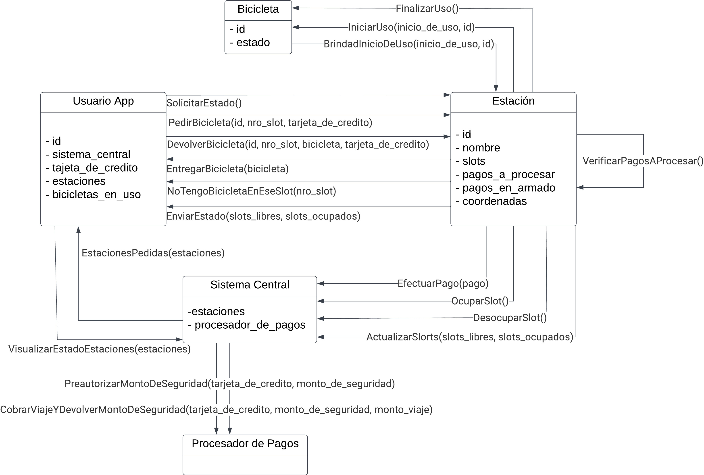

## Protocolos de transporte

Todos los mensajes que implican el alquiler/devolución de bicicletas y/o el pasaje de datos bancarios (tarjeta_de_credito) requerirán su transmisión a través de conexiones TCP, dado que la entrega garantizada (es decir, que ante la pérdida de un paquete, haya una retransmisión) y la detección y posterior corrección de errores serán fundamentales para evitar “estados inválidos” o “situaciones inconclusas”.

En cuanto a los mensajes “informativos”, es decir aquellos que refieren al pasaje de información respecto al estado de una estación o, incluso, la misma solicitud de esta información, serán enviados a través del protocolo UDP. Esto se debe a que la pérdida de alguno de estos mensajes, su desordenamiento o corrupción de algún dato no implican daño alguno en el funcionamiento del sistema.

## Casos de interés

### Cálculo de estaciones cercanas y verificación de su estado

Dado que el usuario conoce sus propias coordenadas, y debe poder visualizar el estado de las estaciones cercanas incluso cuando no tenga conexión con el el sistema central, decidimos que el cálculo de las estaciones cercanas se realice en la aplicación del usuario. Para esto, contará con la información de las coordenadas de cada estación. Luego cuando desee efectivamente retirar o devolver una bicicleta, y por ende quiere saber que estaciones tiene cercanas y su estado, el mismo usuario buscará en su diccionario de estaciones aquellas que se encuentren dentro de un radio determinado, y les solicitará el estado de todas estas al sistema central. De esta manera, sabrá la cantidad de slots libres y ocupados de cada una, y podrá elegir a cuál dirigirse para retirar o devolver una bicicleta. Por otro lado, si se encuentra sin conexión con el sistema central, el usuario podrá seguir calculando las estaciones cercanas, pero no podrá conocer su estado actualizado. En este caso, el usuario podrá dirigirse a alguna de las estaciones cercanas, y al llegar a la misma, podrá solicitarle el estado para conocer si tiene slots libres u ocupados y cuales son estos.

### Retirar múltiples bicicletas por el mismo usuario en simultáneo

Hemos decidido que un usuario pueda retirar múltiples bicicletas al mismo tiempo. Esto creemos que puede ser útil para grupos que van a viajar juntos, y dado que el servicio va a ser cobrado de todas formas, no importará realmente a que tarjeta de crédito se le cobre, simplemente importa que se cobre el total de los viajes realizados.

### Dos usuarios solicitan la misma bicicleta al mismo tiempo

En el caso de que dos usuarios soliciten una misma bicicleta al mismo tiempo, solo uno de ellos podrá acceder a la bicicleta, y el otro recibirá un mensaje de que no se pudo entregar la bicicleta. Esto se debe a que la estación, al recibir el pedido de una bicicleta en un slot específico, primero verifica si el slot contiene una bicicleta disponible para ser entregada, y luego, si es así, efectivamente la entrega. Dado que el actor estación procesará los mensajes de forma secuencial, al procesar el segundo mensaje donde se le solicita la bicicleta del mismo slot que en el primer mensaje, ya no se encontrará ocupado por una bicicleta, y por ende, se le notificará al segundo usuario que no se hay bicicleta disponible en ese slot.

### Dos usuarios intentan devolver una bicicleta al mismo slot al mismo tiempo

En el caso de que dos usuarios intenten devolver una bicicleta al mismo slot al mismo tiempo, solo uno de ellos podrá hacerlo, y el otro recibirá un mensaje de que no se pudo realizar la devolución. Esto es similar a lo planteado en el caso anterior, dado que la estación procesará los mensajes de forma secuencial, al procesar el segundo mensaje donde se le solicita la devolución de una bicicleta al mismo slot que en el primer mensaje, ya no se encontrará ocupado, y por ende, se le notificará al segundo usuario que no se pudo realizar la devolución en ese slot.

### Manejo de pagos pendientes frente a una desconexión entre una estación y el sistema central

Una vez que se cuenta con toda la información para notificar del pago a efectuar por la finalización de un viaje al sistema central, la estación lo encola en su cola de pagos a procesar. A se vez, cada vez que una bicicleta es entregada, se encolará un pago a esa misma cola con la información para preautorizar el monto de seguridad. En caso de que la estación se encuentre desconectada del sistema central, desconexión que asumimos que es simulada, se seguirán encolando los pagos a procesar normalmente, y una vez que se restablezca la conexión, la estación se encargará de vaciar la cola de pagos a procesar, notificando al sistema central para que este se encargue de concretar cada pago.

### Cómo se recupera el estado de una entidad luego de una caída

Consideramos que para garantizar que no se pierda información relevante para el funcionamiento del sistema, ante cada cambio de estado importante, cada entidad se encargará de escribir en un archivo de log la información necesaria para poder recuperar su estado luego de una caída. De esta manera, ante una caída, la entidad podrá leer su archivo de log y recuperar su estado previo a la caída, para luego seguir funcionando normalmente.

## Diagramas de secuencia

### Caso 1 - Secuencia de caso principal

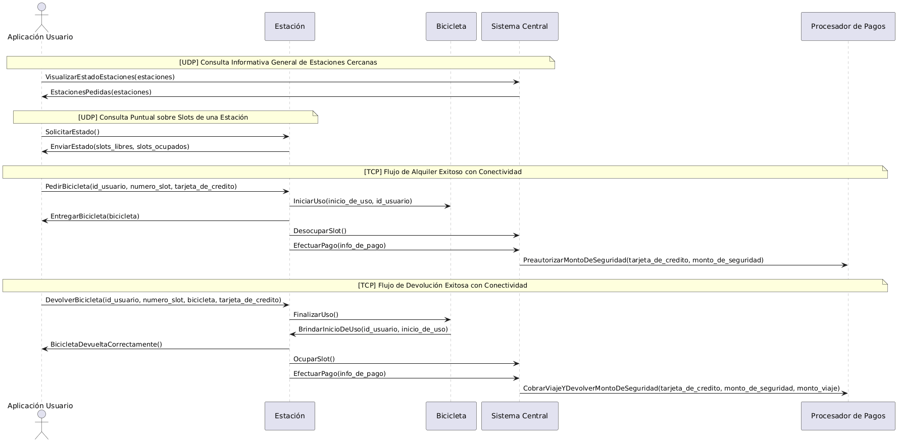

En este diagrama modelamos el ciclo de vida común del programa. Comienza con las consultas informativas de disponibilidad geográfica mediante el protocolo no orientado a conexión UDP. Luego, detalla las fases de un alquiler exitoso (donde se efectúa la preautorización del depósito de seguridad) y una devolución estándar (donde se calcula el costo del viaje y se efectúa el cobro definitivo de manera síncrona ante el Procesador de Pagos por canales confiables TCP). En este caso la estación mantiene conexión con el sistema central durante todo el proceso, por lo que no se presentan situaciones de desconexión o manejo de pagos pendientes encolados.

### Caso 2 - Dos usuarios solicitan una bicicleta en el mismo slot al mismo tiempo

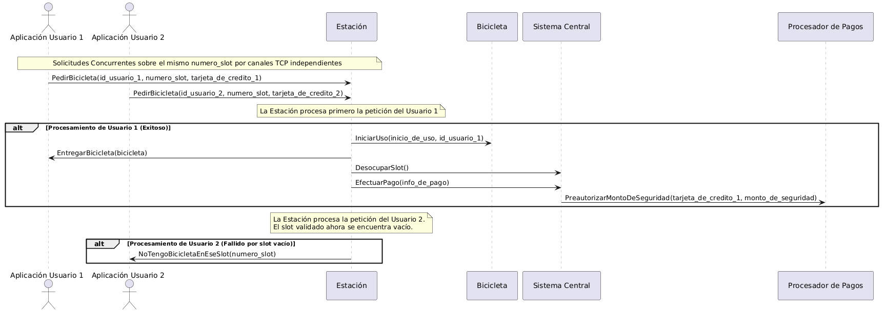

Aquí se modela la situación donde dos usuarios intentan solicitar la bicicleta del mismo slot al mismo tiempo. Dado que la estación procesa los mensajes de forma secuencial, el primer usuario que llegue a solicitar la bicicleta del slot, y esta se encuentre disponible, podrá acceder a ella, mientras que el segundo usuario recibirá un mensaje de que no se pudo entregar la bicicleta, ya que el slot ya no se encontrará ocupado por una bicicleta disponible para ser entregada.

### Caso 3 - Dos usuarios intentan devolver una bicicleta al mismo slot al mismo tiempo

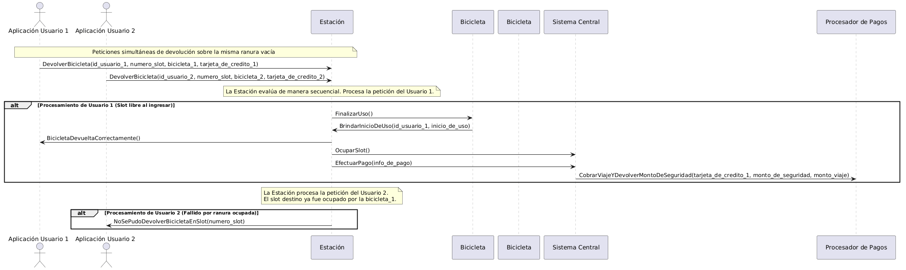

Aquí se modela la situación donde dos usuarios intentan devolver una bicicleta al mismo slot al mismo tiempo. Dado que la estación procesa los mensajes de forma secuencial, el primer usuario que llegue a solicitar la devolución de una bicicleta al slot, y este se encuentre vacío, podrá realizar la devolución, mientras que el segundo usuario recibirá un mensaje de que no se pudo realizar la devolución en ese slot, ya que el slot ya no se encontrará vacío para recibir una bicicleta.

### Caso 4 - Manejo de pagos pendientes frente a una desconexión entre una estación y el sistema central

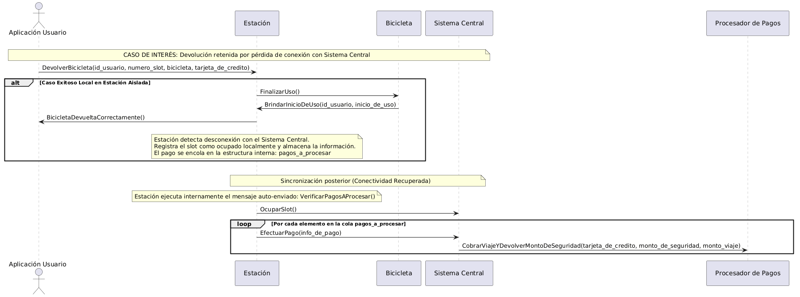

En este diagrama se muestra la secuencia de mensajes que se desencadena ante una **desconexión entre una estación y el sistema central**, y cómo se manejan los pagos pendientes que se van acumulando durante el periodo de desconexión. Se modela la situación donde un usuario devuelve una bicicleta a una estación que se encuentra desconectada del sistema central, y luego se restablece la conexión. Durante el periodo de desconexión, la estación encola el pago del viaje finalizado en su cola de pagos pendientes, y una vez que se restablece la conexión, la estación vacía su cola de pagos pendientes notificando al sistema central para que este se encargue de concretar cada pago. La estación se manda a sí misma el mensaje `VerificarPagosAProcesar` para desencadenar el proceso de vaciado de la cola de pagos pendientes, y este proceso se repite hasta que la cola quede vacía.

### Caso 5 - Manejo de varios pedidos mientras el sistema central está desconectado

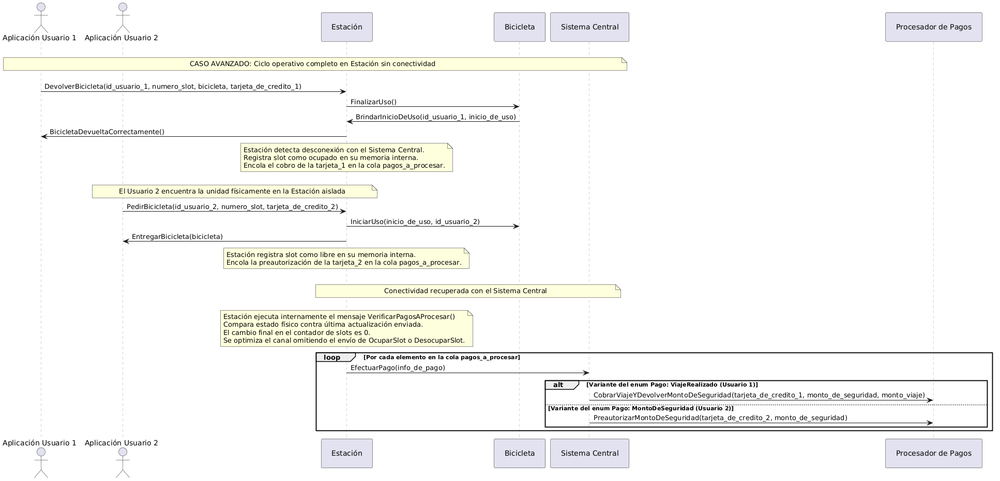

Para este caso analizamos la secuencia de mensajes ante una pérdida total de conectividad entre una **Estación** y el **Sistema Central**. Intentamos ver cómo funciona la conexión directa entre Usuario y Estación, para poder soportar la desconexión con el Sistema Central.

Fase 1: Devolución de Bicicleta (Usuario 1)

- **Acción del Usuario 1**: El Usuario 1 llega a la estación y solicita la devolución de una bicicleta en un slot vacío con una conexión directa **TCP**.
- **Procesamiento Local**: La Estación interactúa con la Bicicleta para dar el cierre temporal al viaje (`FinalizarUso()`) y obtener el tiempo exacto de inicio del recorrido (`BrindarInicioDeUso()`).
- **Respuesta al Usuario**: La Estación valida la devolución física de la bicicleta y confirma inmediatamente al dispositivo móvil que la operación fue exitosa (`BicicletaDevueltaCorrectamente()`), liberando al usuario.
- **Manejo del Fallo**: Al intentar actualizar el estado al Sistema Central, la Estación detecta que no tiene conectividad. Ante esto, igualmente marca el slot como **ocupado** y junta los datos de la tarjeta junto al tiempo de uso en un struct, encolándolo en su lista de pagos pendientes (`pagos_a_procesar`).

Fase 2: Nuevo Alquiler de Bicicleta (Usuario 2)

- **Acción del Usuario 2**: Un Usuario 2 ve la bicicleta disponible físicamente en la estación (a pesar de que en la aplicación móvil general figurará como slot vacío debido al desfase del Sistema Central) y la solicita por **TCP** directo a la Estación.
- **Validación Local**: La Estación no depende del servidor central para operar. En este caso consulta su conjunto local de slots, verifica que la bicicleta está presente y disponible, e inicia el viaje en la entidad Bicicleta.
- **Entrega**: El slot se libera y el Usuario 2 se retira con la unidad. La Estación registra internamente que el slot vuelve a estar **vacío** y encola la transacción de preautorización en la cola de `pagos_a_procesar`.

Fase 3: Conectividad con Sistema Central
Cuando la conectividad con el Sistema Central se restablece, la Estación hace lo siguiente:

1. **Sincronización de estructuras**: La estación debe actualizar el estado de sus slots con el Sistema Central para que este tenga la información correcta. Para esto, le envía un mensaje `ActualizarSlots(slots_libres, slots_ocupados)` con la cantidad de slots libres y ocupados actualizada.
2. **Procesamiento de pagos**: La estación se manda a sí misma el mensaje `VerificarPagosAProcesar()` para iniciar el proceso de vaciado de la cola de pagos pendientes. Para cada pago pendiente, la estación lo desencola y le envía al Sistema Central el mensaje `EfectuarPago(info_de_pago)` para que este se encargue de concretar el pago con el procesador de pagos. Este proceso se repite hasta que la cola de pagos pendientes quede vacía.

---

# Anexo: Cambios realizados para la entrega final

## Herramientas de concurrencia distribuida utilizadas

### Algoritmo Ring

Como se mencionó en la primera entrega, nuestro sistema presenta un “Sistema Central” que se encarga de registrar alquileres y devoluciones; comunicarse con el procesador de pagos, para procesar pre-autorizaciones, cobros y multas; y con los usuarios, para enviarles información sobre el estado (slots y conectividad actual) de un conjunto de estaciones. En nuestro primer planteo, este sistema era una entidad aparte del resto. No obstante, notamos que esto se trataba de un **punto único de falla** y es por ello que decidimos que esta funcionalidad sea adoptada por una **estación, que toma el rol de líder**. Este rol es obtenido mediante el **Algoritmo Ring** (o Anillo), con una implementación muy similar a la vista en clase, en la que la estación con mayor ID conectada es la que asume esta función. De esta forma, logramos que ante la caída de la estación líder, se lance una nueva elección, logrando mantener una alta disponibilidad en el funcionamiento del sistema.

Al haber realizado una implementación similar a la vista en clase, ante la ausencia de una estación de ID “intermedio” (supongamos 1 -> ~2~ -> 3), el anillo es capaz de saltarse aquellas estaciones que no respondan (ACK) a un mensaje de elección (ELEC) o coordinación de un nuevo líder (COOR), permitiendo una gran resiliencia y habilitando el funcionamiento del sistema aún cuando sólo unas pocas estaciones (o, incluso, una sola) se encuentren conectadas.

### Transacciones Two-Phase Commit

La pre-autorización efectuada al alquilar una bicicleta **ya no es más un simple reenvío de mensajes**, como sucedía en la entrega previa. Ahora, todo este proceso se realiza siguiendo los lineamientos dictados por el **Algoritmo de Commit de Dos Fases** (o Two-Phase Commit),  en el que una estación, al recibir la solicitud de alquiler de una bicicleta, arma un mensaje de preparación (PREPARE) y lo envía a la estación líder. Esta, al recibirlo, lo reenvía al procesador de pagos, quien, con una probabilidad configurable, puede aceptar o rechazar.  Si lo acepta, envía su confirmación (COMMIT) y si no, envía la cancelación de la operación (ABORT). Al recibir esta respuesta, la estación líder efectúa los cambios correspondientes en caso de éxito (modificar su vector de alquileres activos y persiste en disco la operación), y envía la respuesta a la estación, que en caso de éxito libera la bicicleta y persiste el nuevo estado del slot. Dada una  cancelación de la operación, por parte del procesador de pagos, simplemente informa al usuario de lo sucedido y la bicicleta se mantiene en su slot.

## Persistencia

### Persistencia de usuarios

Luego de alquilar o devolver una bicicleta, los usuarios persisten las bicicletas que poseen. De esta forma, ante una detención en su ejecución, son capaces de “recuperar” las bicicletas que habían alquilado. Esto nos permite que las mismas no “desaparezcan” del sistema ante una situación como la mencionada.

### Persistencia de estaciones

Las estaciones, por su parte, persisten el estado de sus slots en disco. De esta manera, es posible detener su ejecución sin que desaparezcan ni aparezcan bicicletas al reanudarla.

### Persistencia de alquileres activos

La estación elegida como líder (únicamente esta, para evitar condiciones de carreras), tiene acceso a un archivo (que podría ser visto como una base de datos) en el que persiste los alquileres activos y su tiempo de inicio. Así, es posible que, ante la caída de un líder, el siguiente en tomar este rol sea capaz de cobrar las multas que sean pertinentes.

## Desconexiones

### Desconexión de usuarios

En nuestro sistema es posible simular pérdidas de conexión por parte de los usuarios. Ante este caso, estos pueden seguir comunicándose con estaciones individuales para alquilar/devolver bicicletas o solicitar el estado de sus slots (operaciones que, por ejemplo, se realizarían por Bluetooth), pero no pueden comunicarse con la estación líder (ni intentar conocer quién es el líder), de forma que pierden la capacidad de conocer el estado de un conjunto de estaciones (operación que se realizaría mediante internet).

### Desconexión de estaciones

De igual manera que los usuarios, las estaciones también pueden funcionar de forma desconectada del resto de la red (lo que, en este caso, sería **por fuera del anillo de estaciones**). Durante este estado, las estaciones pueden seguir procesando alquileres, devoluciones y entregando información de sus slots (como se mencionó en el apartado anterior, operaciones que se realizarían de forma directa con los usuarios, por algún tipo de conectividad que soporte tráfico TCP, como Bluetooth). La gran diferencia, respecto a su estado opuesto, radica en que no conocen al líder, ni pueden ser elegidas con este rol. De esta forma, los pagos asociados a las operaciones que se realicen mientras está desconectada, son encolados en una cola de pagos pendientes y enviados a la estación líder cuando la conexión se restablece.

Al desarrollar esta funcionalidad nos enfrentamos con el **teorema de CAP**, que establece que, en un sistema distribuido, es imposible garantizar simultáneamente *consistencia*, *disponibilidad* y *tolerancia al particionado*. En nuestro caso, **priorizamos la alta disponibilidad**, garantizando que, aunque una estación esté desconectada y, por ende, no pueda procesar pagos, sea capaz que recibir alquileres, corriendo el riesgo de que una pre-autorización sea rechazada (y que la bicicleta haya sido entregada de todas formas). Además, otra inconsistencia se da al consultarle a la estación líder por el estado actual de esta estación, ya que tiene que brindar su estado indicando explícitamente que, a pesar de que se brinda cierta información (su último estado de slots registrado), esta es “incierta”.

## Detección de robos

Como bien se mencionó, la estación líder conoce todos los alquileres activos. Esto le permite, cada vez que se registra uno nuevo, lanzar una tarea a futuro, luego del tiempo determinado para la aplicación del multado, que verifica si el alquiler sigue activo y, en tal caso, efectúa la multa.

Esta “técnica” de lanzar una tarea a futuro (dentro del actor, con ```ctx.run_later()```), **nos permitió evitar la realización de un busy waiting**, que verifique cada una determinada cantidad de segundos si se debe multar a algún usuario. Es algo que habíamos implementado inicialmente y rápidamente notamos que no se trataba del procedimiento correcto a realizar.

## Cambios en manejo de casos de interés

### Un usuario solicita una bicicleta, mientras está siendo procesado la pre-autorización de otro usuario, para retirar la misma

Ante esta situación,   decidimos implementar un estado “intermedio” en los slots de las estaciones. Así, mientras se encuentra procesando la pre-autorización para retirar la bicicleta de un slot, este pasa a estar en estado “preparando un retiro” y, por ende, no permite que otro usuario alquile esa misma bicicleta (informándole, explícitamente, a través del nuevo mensaje ```HayPedidoEnProceso```, de la situación).

## Cambios en estructuras y mensajes principales del sistema

### Las bicicletas ya no son binarios ejecutables

Como bien indica el título de esta subsección, las bicicletas ya no son “programas aparte”, sino que son instancias de una estructura, equivalente a la que íbamos a utilizar inicialmente, que se envían en los mensajes de ```PedirBicicleta``` y ```DevolverBicicleta```; y se almacenan tanto en los slots de las estaciones, como en el diccionario denominado ```bicicletas_en_uso```, de los usuarios.

### El Sistema Central ahora forma parte de Estación

La justificación detrás de esta decisión se indicó al comienzo de este anexo. Es por ello que a continuación simplemente se muestra cómo quedó la estructura finalmente y se detalla, muy brevemente, cada uno de sus componentes:

```rust
pub struct Estacion {
    pub id: usize,
    pub nombre: String,
    pub slots: Vec<EstadoSlot>,
    pub coordenadas: Coordenadas,
    pub conectado: bool,
    pub tx_tcp: Option<mpsc::Sender<String>>,
    pub otras_estaciones: HashSet<usize>,
    pub lider_actual: Option<usize>,
    pub procesador_de_pagos: SocketAddr,
    pub estaciones_info: Vec<EstacionInfo>,
    pub ring_eleccion: Option<EleccionLider>,
    pub servidor_tcp_iniciado: bool,
    pub seguidores_tx: HashMap<usize, mpsc::Sender<String>>,
    pub alquileres_activos: HashMap<usize, Vec<(usize, Instant, TarjetaDeCredito)>>,
    pub pagos_pendientes: VecDeque<String>,
}
```

- `id`: Identificador numérico único de la estación.
- `nombre`: Nombre legible de la estación.
- `slots`: Colección de `EstadoSlot`, indicando el estado actual de cada slot y almacenando su bicicleta, de poseerla.
- `coordenadas`: Ubicación geográfica (latitud, longitud).
- `conectado`: Indica si la estación tiene conexión de red (simulada).
- `tx_tcp`: Canal para enviar mensajes TCP salientes (hacia el líder), si la estación es seguidora.
- `otras_estaciones`: Conjunto con los IDs del resto de estaciones.
- `lider_actual`: ID del líder coordinador del sistema. `None` si la red está en proceso de elección o la estación se encuentra desconectada.
- `procesador_de_pagos`: Dirección socket donde atiende el servidor de pagos.
- `estaciones_info`: Caché del estado general de las estaciones. Solo se mantiene actualizado si la estación actual es líder.
- `ring_eleccion`: Instancia del manejador del protocolo de elección por anillo.
- `servidor_tcp_iniciado`: Indica si el proceso de escucha TCP para nodos seguidores está activo.
- `seguidores_tx`: Canales para enviar mensajes  a los estaciones seguidoras (si actúa como líder).
- `alquileres_activos`: Alquileres actualmente en curso, iniciados en esta estación.
- `pagos_pendientes`: Cola de comandos de pago que esperan ser despachados al líder cuando se recupere la conexión.

### Respuesta de `HayPedidoEnProceso` al efectuar un alquiler

Como se explicó en detalle en el caso de interés correspondiente, se introduce un nuevo mensaje que puede ser respondido por una estación a un usuario, ante el intento de alquiler de una bicicleta:

```rust
pub struct HayPedidoEnProcesoEnEseSlot {
    pub numero_slot: u8,
}
```

Lo que, en consecuencia, también implica el agregado de un nuevo estado en los slots:

```rust
#[derive(Clone, Debug)]
pub enum EstadoSlot {
    /// El slot se encuentra libre y listo para recibir una bicicleta.
    Vacio,
    /// El slot contiene una bicicleta que puede estar disponible o en uso (físicamente retenida).
    Ocupado(Bicicleta),
    /// Estado transitorio (Fase 1 de 2PC) que bloquea el slot mientras se autoriza el pago.
    /// Almacena la bicicleta, el ID del usuario solicitante y el canal para enviarle la respuesta asíncrona.
    PreparandoRetiro(Bicicleta, usize, mpsc::Sender<Vec<u8>>),
}
```

Ahora, un slot puede estar “preparando un retiro”, almacenando la bicicleta que contiene, el ID del usuario que la desea y un canal transmisor (Sender), para comunicarse con la tarea encargada de la comunicación TCP con el usuario.

### Mensajes enviados para el procesamiento de pagos y aviso de ocupación/desocupación de slots

Los mensajes originales dificultaban la implementación del 2PC, es por ello que ahora los mensajes enviados presentan las siguientes características:

#### Estación -> Estación Líder

- `PREPARE_PAGO_RETIRO:{ID Estación}:{Nro. Slot}:{ID Usuario}:{ID Bicicleta}:{Monto de Seguridad}:{Tarjeta de Crédito}`
- `COBRO_VIAJE:{ID Estación}:{ID Usuario}:{ID Bicicleta}:{Monto a Cobrar}:{Tarjeta de Crédito}`

#### Estación Líder -> Estación

- `COMMIT_PAGO_RETIRO:{Nro. Slot}:{ID Usuario}`
- `ABORT_PAGO_RETIRO:{Nro. Slot}:{ID Usuario}`

#### Estación Líder -> Procesador de Pagos

- `PREPARE_PAGO_RETIRO:{ID Estación}:{ID Usuario}:{Monto}:{Tarjeta de Crédito}`
- `COBRO_VIAJE:{Monto a Cobrar}:{Monto de Seguridad}:{Tarjeta de Crédito}`

#### Procesador de Pagos -> Estación Líder

- `COMMIT`
- `ABORT`

Además, la estación líder aprovecha estos mensajes para actualizar el estado de los slots que almacena de la estación en cuestión, por lo que ya no son necesarios los mensajes de `OcuparSlot` y `DesocuparSlot`.

## ¿Cómo conoce un usuario quién es el líder actual?

Dado que el líder del sistema es una entidad cambiante, es importante que los usuarios sean capaces de conocer quién es el líder del mismo, para poder interactuar con este. Es por ello que, ante una solicitud del estado de un conjunto de estaciones, el usuario primero realiza una etapa de “descubrimiento” del líder, en el que le consulta a la estación más cercana a sus coordenadas quién es el líder actual, para luego comunicarse con este. Si la estación más cercana no responde a la petición luego de un determinado tiempo (timeout), procede a consultarle a la siguiente estación más cercana y así sucesivamente, hasta encontrar una que responda. Si ninguna lo hace, simplemente se muestra que la operación falló (no hay estaciones conectadas -> no hay líder -> nadie conoce el estado actual del conjunto de estaciones buscado).

## Modelo de actores

Tanto los usuarios (estructura `UsuarioApp`), como las estaciones (estructura `Estacion`), funcionan utilizando el modelo indicado en el título de esta sección.

## Logging

Todas las operaciones efectuadas internamente por cada una de las entidades (alquileres, devoluciones, pagos, cambios de líder, detección de caídas, multados, etc) son mostradas por pantalla.

## Manejo de errores

Todo el código escrito maneja los errores siguiendo los lineamientos impuestos por Rust para la irrupción no abrupta de ellos. Es por esto que se pueden encontrar módulos con enumerables de errores personalizados y no hay presencia de `unwrap` ni `expect` en todo el código (excepto en los tests, donde las situaciones de falla son algo necesario, ante un error).

## Tests

La implementación del sistema, en su totalidad, fue testeada unitariamente y, para respaldar su funcionamiento, se realizaron tests de integración que prueban el flujo completo del mismo y algunos casos “borde” o “de interés”.

## Interfaz y opciones que un usuario puede realizar en la aplicación

A continuación se muestra la pantalla que es mostrada en la aplicación del usuario, donde este puede seleccionar la opción que desee. Entre ellas, aparte de las operaciones mencionadas, puede cambiar sus coordenadas actuales, observar su información asociada (ID, coordenadas y tarjeta de crédito), cambiar su estado de conectividad (inicialmente arranca desconectado) y salir del programa.


## Cómo correr cada entidad (binario) y sus argumentos

A continuación se muestra cómo correr cada uno de los binarios correspondientes a cada entidad, y los argumentos que se le deben pasar a cada uno:

### Estación

Para levantar una estación se debe ejecutar el siguiente comando:

```bash
cargo run --bin estacion -- <id_estacion> [<esta_conectada>] 
```

La configuración de la estación con el id indicado debe encontrarse en el archivo estaciones.config. Este contiene el id, nombre, latitud, longitud y la cantidad de slots de la estación. Entonces, si el id indicado no se corresponde con alguno del archivo de configuración se imprimirá por consola el aviso y no continuará la ejecución. En el caso contrario, se tomarán estos datos del archivo de configuración para la creación de la estación. Además, si existe un archivo estación_<id_estacion>.state en la carpeta estado_estaciones significa que esta estación estuvo previamente en ejecución y se recupera el estado de sus slots, es decir, si se encuentran vacíos o que bicicleta contienen. Si no existe un archivo de estado entonces los slots de las estaciones son completados con bicicletas disponibles con id único.

El parámetro <esta_conectada> es opcional e indica si la estación está o no conectada. Si no se proporciona o no se recibe correctamente (debe ser “1”) se iniciará desconectada. También es posible modificar este estado presionando una tecla.

Por ejemplo, para levantar la estación de id 1 conectada se ejecuta:

```bash
cargo run --bin estacion -- 1 1
```

### Usuario App

Para levantar una aplicación de usuario se debe ejecutar el siguiente comando:

```bash
cargo run --bin usuario_app -- <id_usuario_app> [<longitud> <latitud>]
```

A diferencia de la estación, la aplicación de usuario no se encuentra en ningún archivo de configuración por lo que su id puede ser cualquier número entero positivo, siempre y cuando no coincida con el de otra en ejecución. Si existe un archivo estado_usuario_<id_usuario>.state en la carpeta estado_usuarios significa que esta aplicación de usuario estuvo en ejecución previamente y se recuperará su estado. Su estado consiste en las últimas coordenadas conocidas, su tarjeta de crédito y todas las bicicletas tiene en uso.

Los parámetro de la longitud y latitud son opcionales, si no se especifican entonces serán 0 ambas. Si se especifican pero existe un archivo de estado entonces se ignorarán.

Por ejemplo, para levantar la aplicación de usuario con id 1 en las coordenadas (10, 10) se deberá ejecutar:

```bash
cargo run --bin usuario_app -- 1 10 10
```

### Procesador de Pagos

Para levantar el procesador de pagos se deberá ejecutar el siguiente comando:

```bash
cargo run --bin procesador_de_pagos -- <probabilidad> <tiempo_de_respuesta>
```

La probabilidad indicada debe ser entre un número entre 0.0 y 1.0. Esta corresponde a la probabilidad de que una preautorización del monto de seguridad sea aceptada.

El tiempo de respuesta debe ser un número que representa el tiempo, en milisegundos, que tardará en procesar una solicitud.

## Diagramas actualizados

### Diagrama de entidades actualizado

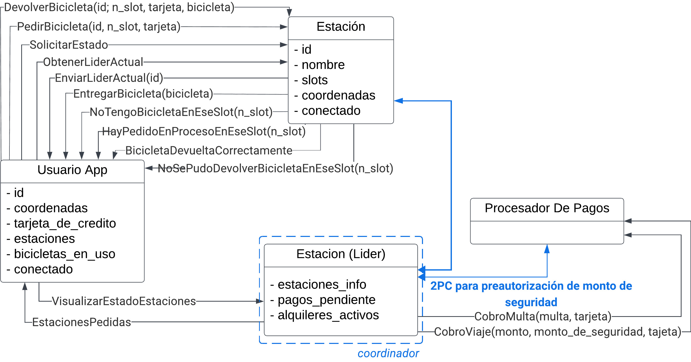

### Nuevos diagramas de secuencia

#### **Persistencia y recuperación de datos**

En este diagrama podemos ver el flujo de guardado y recuperación de datos para usuarios, estaciones seguidoras y líderes.

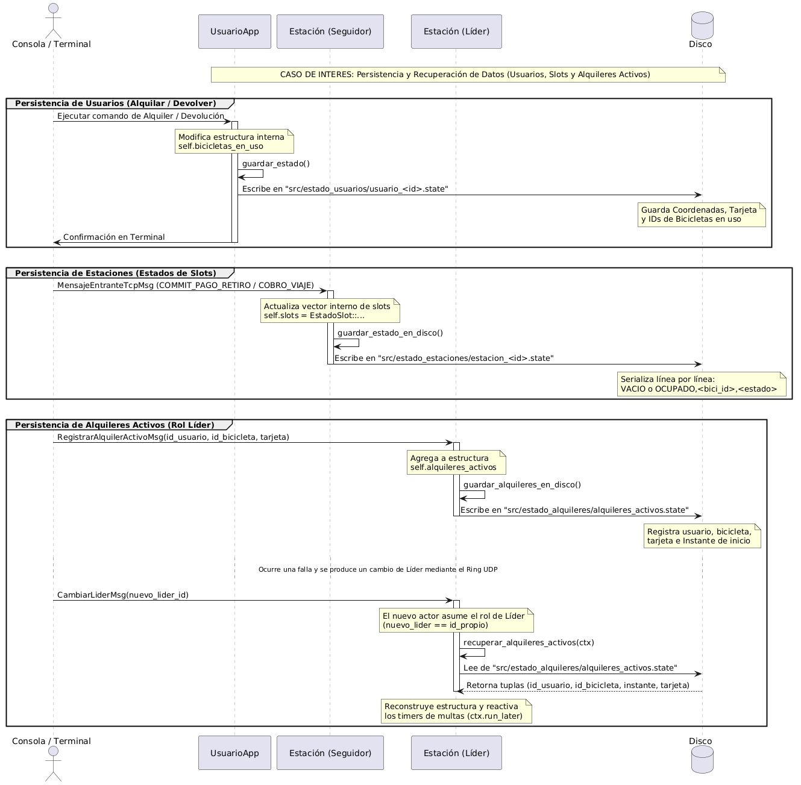

#### **Robo de bicicleta por exceder tiempo de uso límite**

Aquí vemos lo que ocurre cuando un usuario retira una bicicleta y la utiliza por más tiempo que el permitido (por lo cual se asume que **hubo un robo**).

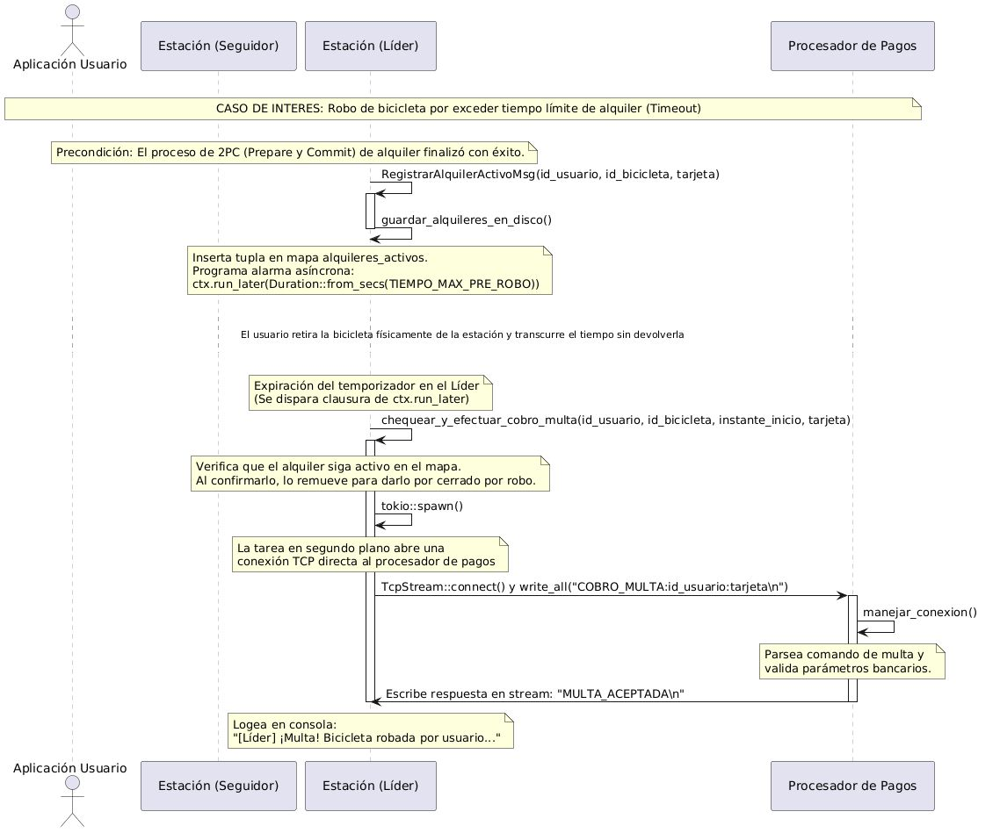

#### **Elección de Líder - Algoritmo Ring**

En este diagrama mostramos cómo funciona el algoritmo Ring, que tiene como objetivo efectuar una **nueva elección de líder** ante una falla del líder anterior.

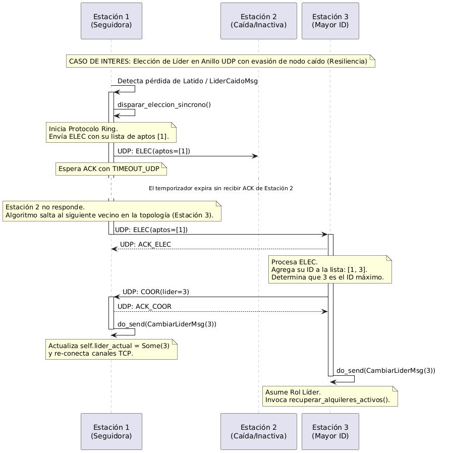

#### **Transacciones y Cobros - Algoritmo 2PC**

En este diagrama mostramos cómo se usa el algoritmo **Two-Phase Commit (2PC)** para garantizar, con distintos tipos de mensajes (`PREPARE`, `COMMIT`, `ABORT`) que le llegue al usuario el resultado correspondiente al intentar retirar una bicicleta y efectuar el pago de pre-autorización. Este algoritmo se utiliza únicamente en el cobro de este pago, ya que luego de consultar hemos podido asumir que el cobro final del viaje siempre tendrá éxito. Como hemos visto, la **probabilidad de falla del procesador de pagos** funciona como un argumento al ejecutar su binario, y se utiliza para definir si el pago (simulado) será aceptado o rechazado.

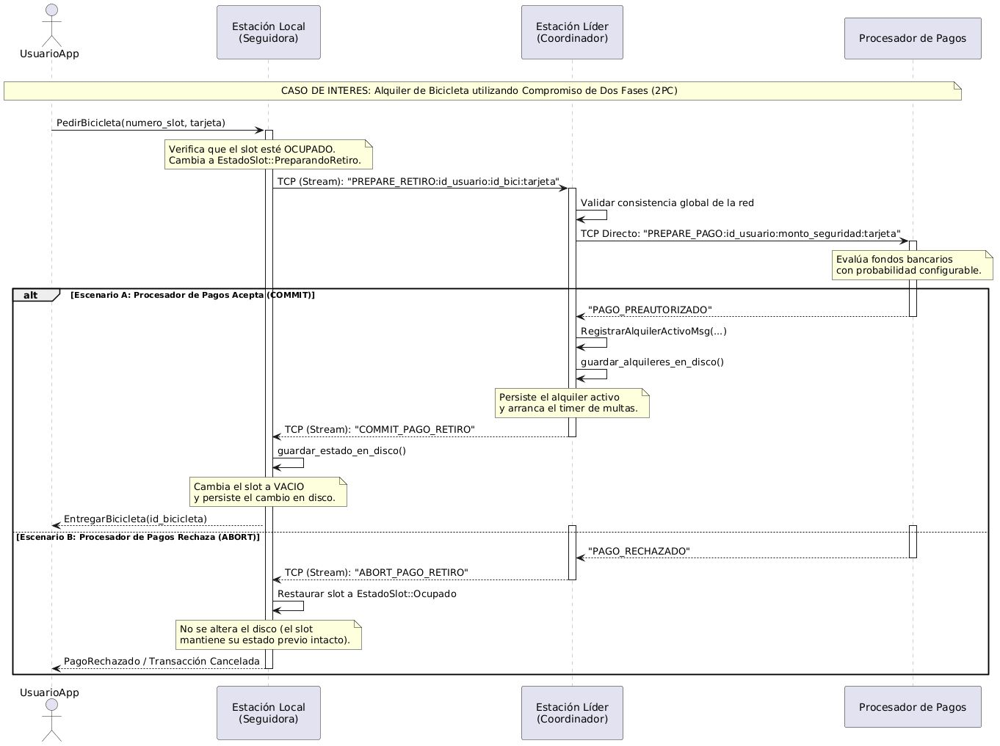

#### **Pedido de bicicleta concurrente en mismo slot**

Aquí se puede ver de qué maneras puede reaccionar una estación a pedidos de bicicletas concurrentes en un mismo slot. En este caso, definimos que se tratan de pedidos concurrentes porque aún no se ha procesado de forma completa la pre-autorización de ninguno de los dos pedidos. Se puede observar **qué sucede si un usuario pide una bicicleta en un slot que ya tiene pendiente la pre-autorización y el retiro de la misma bicicleta por parte de otro usuario**.

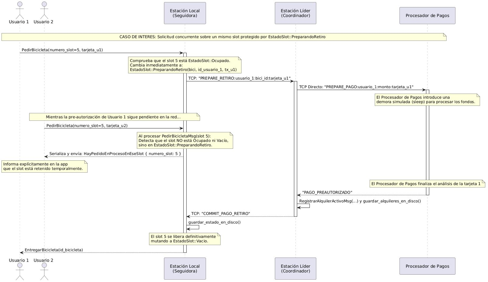

#### **Desconexión de Usuarios y Estaciones**

Por último, en este caso vemos cómo reaccionan las entidades (usuarios y estaciones) ante una pérdida de conexión entre ellas. Puede ocurrir que el usuario se desconecte momentáneamente, o bien que alguna de las estaciones esté desconectada del anillo principal de estaciones. En ambos casos, se realizan medidas para **favorecer la disponibilidad por sobre la consistencia**.

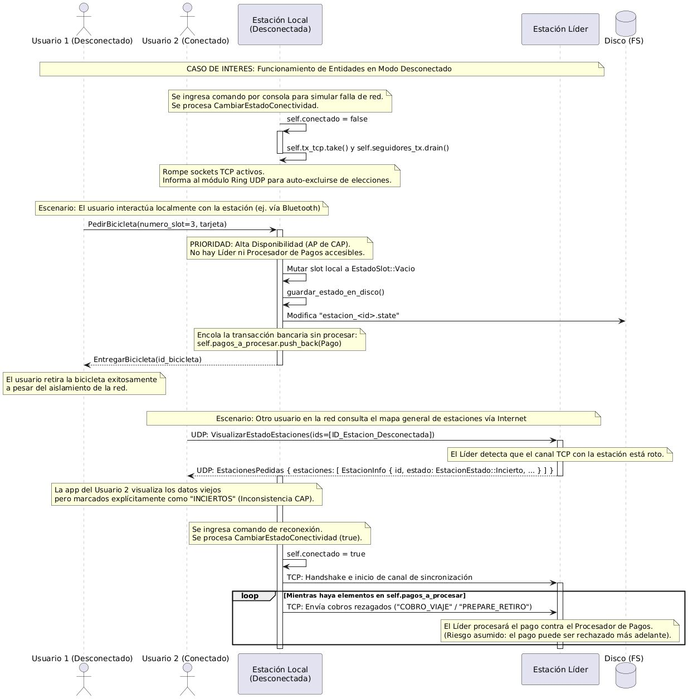
